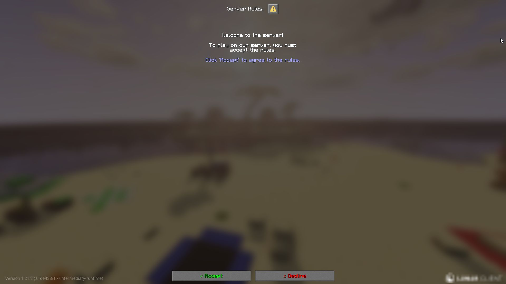
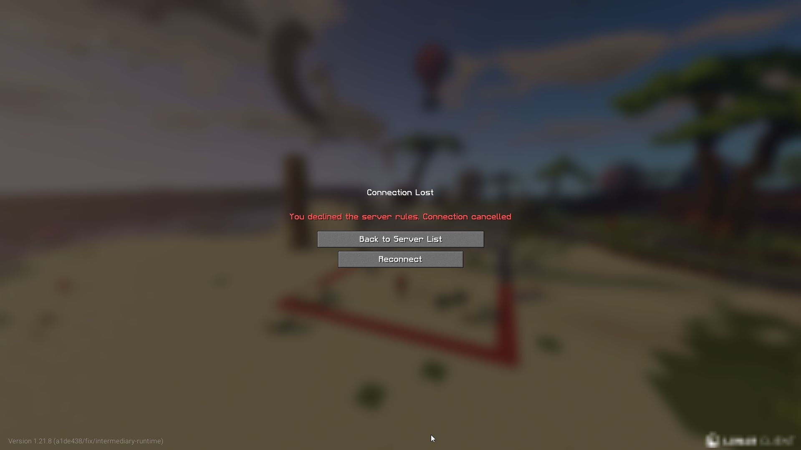
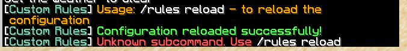
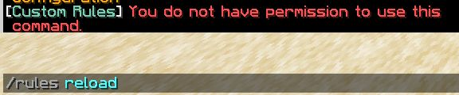

    <h1 align="center">Custom Rules Plugin</h1>

    

---

    <h2 align="center">📜 Description</h2>

The **Custom Rules Plugin** allows server administrators to show a rules dialog to players on join and enforce acceptance before playing. It is fully configurable, including messages, colors, and button actions.

---

    <h2 align="center">⚡ Features</h2>

- Customizable rules dialog on player join
- Accept or decline rules with automatic handling
- Configurable messages and colors
- Permission-based command system

---

    <h2 align="center">🛠 Commands</h2>

### `/rules`

Manage plugin rules.

| Subcommand | Description                      | Permission           | Usage           |
|------------|----------------------------------|-------------------|----------------|
| `reload`   | Reloads the plugin configuration | `customrules.reload` | `/rules reload` |

---

    <h2 align="center">🔑 Permissions</h2>

| Permission               | Description                        | Default |
|---------------------------|------------------------------------|---------|
| `customrules.use`         | Allows using the `/rules` command | op      |
| `customrules.reload`      | Allows reloading the plugin config | op      |

---

    <h2 align="center">⚙ Configuration</h2>

`Check config.yml and rules.yml files`

---

    <h2 align="center">🖼 Photos</h2>

    
    
    
    

